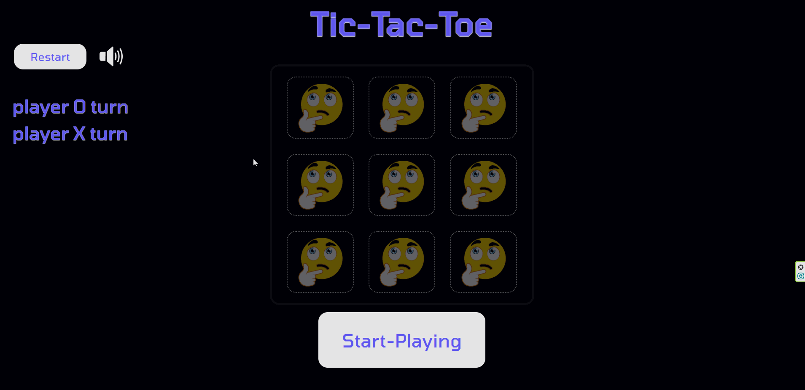

# Tic-Tac-Toe

### This is a web game project, that created with high strictness under the guidance of best practices and standards, a lot of work that summarize my knowladge about css + html + sass + scripts 

#### Try it out: [Live-Demo](https://afektheminilearner.github.io/Tic-tac-toe/)

---

### **Running the project :**

**Requirements**

-   _NodeJS_ version 18.1+

**Command lines**

-   **The command to run the project**
    -   `npm run start`  (runs the project with _lite-server_, styled with the _css_ compiled files)
    -   For developing the _sass_ style its necessary to install _sass_. Than to compile the scss files into css you should run this script : 
        `"sass-compile": "sass styles/scss:styles/css"`

---

### **Small peek to the game:**

---

### Features that I used for the game:

-   [x] **Scripting** : the use of _js_ script files inside the client pages allowed me to interact with the page when the user click on a button or element.
-   [x] **Hovering, animations and sound effects** : using effects while the user hover\clicks on some components & using _keyframes_ animations or sound effects inside the page makes the page more responsive and allow the user to feel better game experience, it improves all of the interaction with the game.
-   [x] **Dark-design** : **the dark theme** allows the game to be more **pleasant and comfort to the eye**, the game looks simple and it makes all of the neccessary elements of the game such as: the game board, the turns display, & other titles and popups **look more highlighted**.
-   [x] **Designing with precision on small aspects** : using features like shadows, borders, fonts, different opacity levels, proper sounds & pictures picking for this game, allowed me to improve the experience while playing it much more.

### Extra technologies i been using for development tools:

-   [x] _**prettier**_ : fix annotation and organized code by standard with _prettier_ watcher.
-   [x] _**sass**_ : using _sass_ allowed me to use mixins, variable, and generally write more organized, simple, and readable code.
-   [x] _**lite-server**_ : watch any real-time changes in the _sass_ & _html_ files.

## Author

:octocat: **Afek Sakaju**

-   LinkedIn: [@afeksa](https://www.linkedin.com/in/afeksa/)
-   GitHub: [@afekTheMiniLearner](https://github.com/afekTheMiniLearner)
