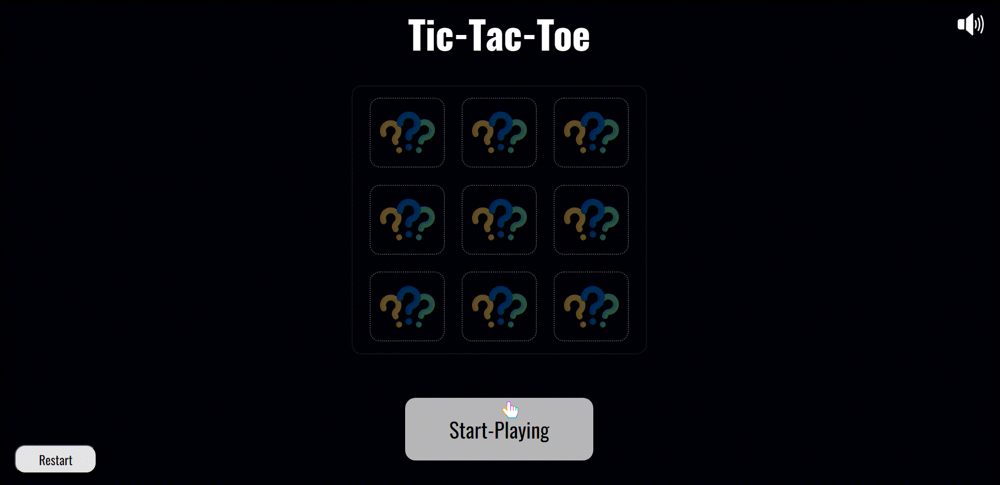

# Tic-Tac-Toe

### This project was developed using JavaScript, HTML, and SCSS. 

#### Try it out: [Live-Demo](https://afektheminilearner.github.io/Tic-Tac-Toe/)

---

### **Running the project :**

**Requirements**

-   _NodeJS_ version 16.4+

**Command lines**

-   `npm run start`  For running the project (with _lite-server_).
-   `npm install`   Install all the necessary packages for developing the project.
-   `sass-compile` Compile all the _SCSS_ files to _CSS_ files. 
-   `npm run sass-watch-folder` Automatically compiles SCSS files into CSS files whenever changes are detected.

---

### **Here's a sneak peek of the game:**

---

### Here are a few features that were implemented in the game:

-   [x] **Scripting** : The utilization of _JavaScript_ script files within the client pages to enable page interaction when the user clicks/hovers on a button or element.
-   [x] **Animations and sound effects** : Incorporating effects when the user hovers or clicks on components, along with using keyframes animations and sound effects, significantly enhances the page's responsiveness.  These additions contribute to a more immersive game experience.
-   [x] **High strictness** : Following best practices and standards, a significant amount of work was dedicated to summarizing my knowledge of JavaScript, HTML, and SCSS.

## Author

:octocat: **Afek Sakaju**

-   LinkedIn: [@afeksa](https://www.linkedin.com/in/afeksa/)
-   GitHub: [@afekTheMiniLearner](https://github.com/afekTheMiniLearner)
